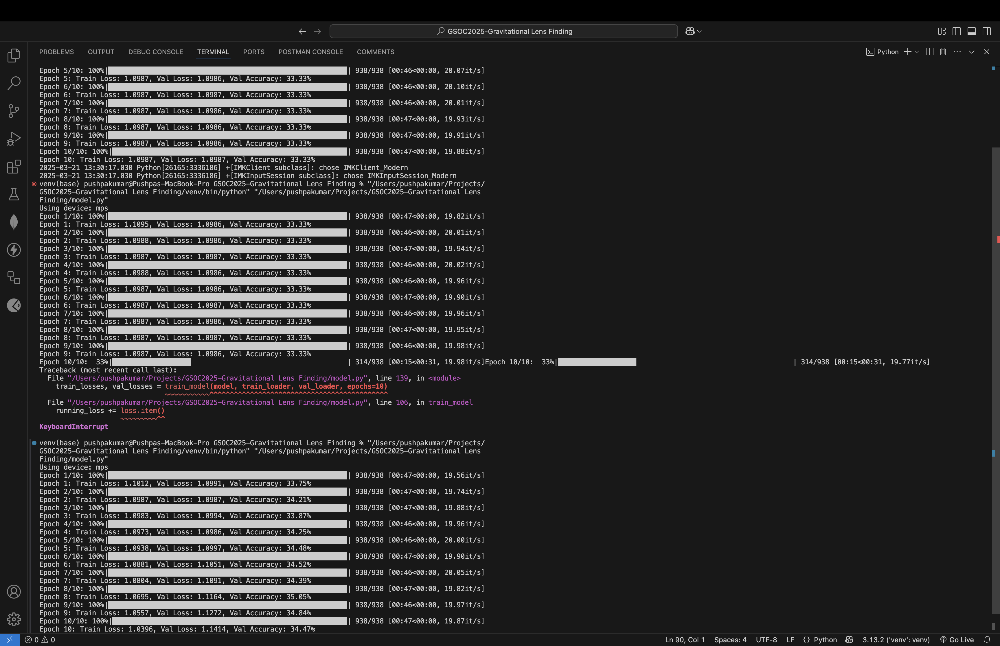

# Common Test I: Multi-Class Classification

## Overview
This project involves building a model to classify gravitational lensing images into three classes: no substructure, subhalo substructure, and vortex substructure.

## Phases of Development

### Phase 1 (Val Accuracy ~35%)
- **Model**: Simple CNN (2 convolutional layers, 2 fully connected layers).
- **Training**: Minimal data augmentation (only normalization).
- **Performance**: Low accuracy due to underfitting.
- **Terminal Output**: 

### Phase 2 (Val Accuracy ~50%)
- **Model**: Same CNN as Phase 1.
- **Training**: Improved hyperparameters (learning rate, batch size) and longer training.
- **Performance**: Moderate accuracy improvement, but still limited.
- **Terminal Output**: 

### Phase 3 (Val Accuracy ~83%)
- **Model**: Upgraded to ResNet18 (pre-trained, modified for single-channel input).
- **Training**: Enhanced data augmentation (flips, rotation, resizing, color jitter) and class weighting.
- **Optimization**: Added learning rate scheduler and early stopping.
- **Performance**: Significant accuracy boost.
- **Terminal Output**: 

### Key Improvements
- **Model Complexity**: Switched from simple CNN to ResNet18.
- **Data Augmentation**: Added advanced transformations.
- **Training Techniques**: Used class weights, learning rate scheduling, and early stopping.

## Results

1. **Terminal Output**: 
2. **Training and Validation Loss Curves**: 
3. **ROC Curve**: 
4. **Confusion Matrix**: 

## How to Run
1. Clone the repository.
2. Install dependencies: `pip install -r requirements.txt`.
3. Run the model:
   - **Option 1**: Execute the Python script: `python model.py`.
   - **Option 2**: Run the Jupyter Notebook: `model.ipynb`.

## Files
- `model.ipynb`: Implementation and evaluation.
- `best_model.pth`: Trained model weights.
- `results/`: Folder containing result screenshots and terminal outputs.