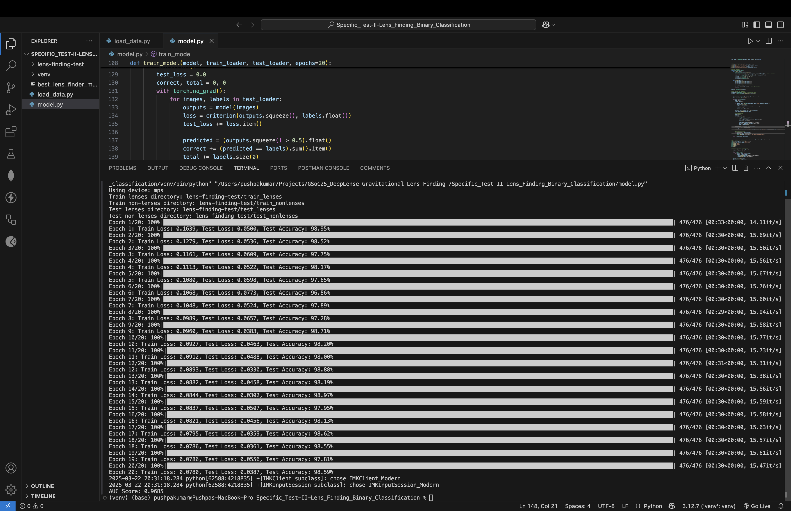
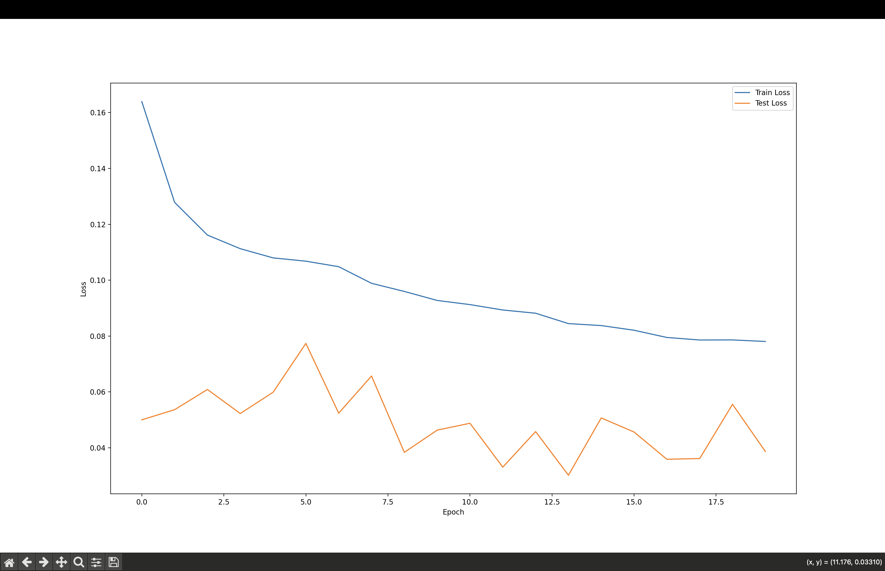
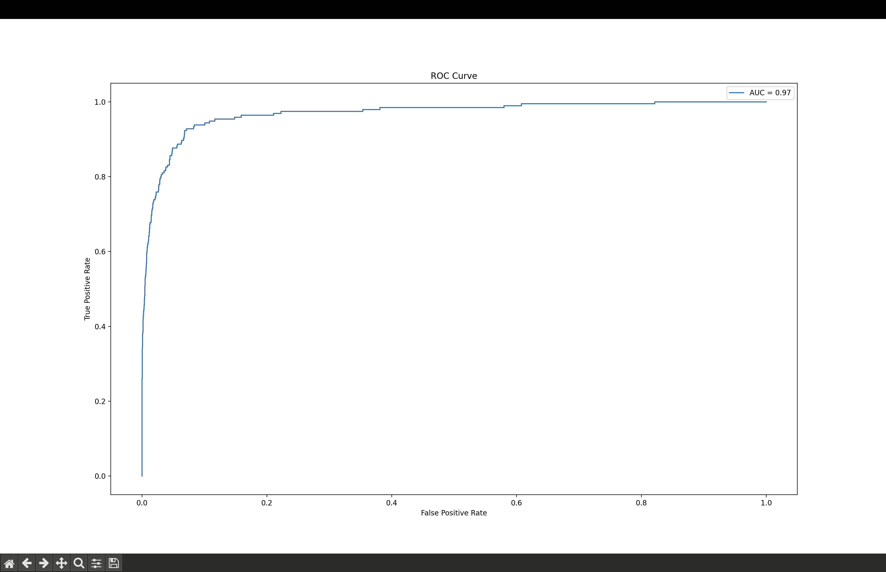
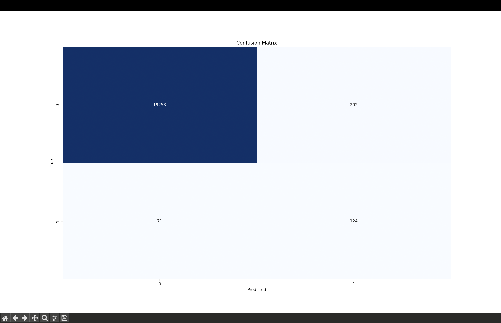

# Specific Test II: Lens Finding

## Overview
This project involves building a binary classification model to identify gravitational lenses using PyTorch. The model distinguishes between lensed and non-lensed galaxies.

## Dataset
- **Train Lenses Directory**: `lens-finding-test/train_lenses`
- **Train Non-Lenses Directory**: `lens-finding-test/train_nonlenses`
- **Test Lenses Directory**: `lens-finding-test/test_lenses`
- **Test Non-Lenses Directory**: `lens-finding-test/test_nonlenses`

## Model Architecture
- **CNN Model**: Custom CNN with 3 convolutional layers and 2 fully connected layers.
- **Loss Function**: Binary Cross-Entropy Loss.
- **Optimizer**: Adam with learning rate 0.0001.

## Results
1. **Best Test Accuracy**: 
2. **Loss Curves**: 
3. **ROC Curve**: 
4. **Confusion Matrix**: 

## How to Run
1. Clone the repository.
2. Install dependencies: `pip install -r requirements.txt`.
3. Run the model:
   - **Option 1**: Execute the Python script: `python model.py`.
   - **Option 2**: Run the Jupyter Notebook: `model.ipynb`.

## Files
- `specific_test_ii.ipynb`: Implementation and evaluation.
- `best_lens_finder_model.pth`: Trained model weights.
- `result/`: Folder containing result screenshots.
