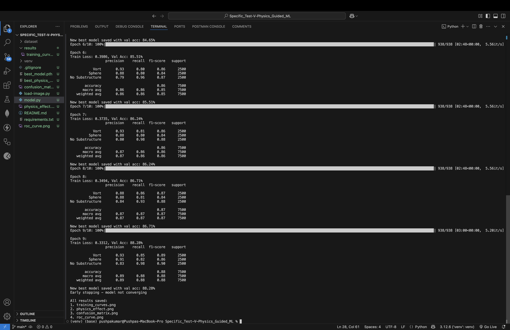
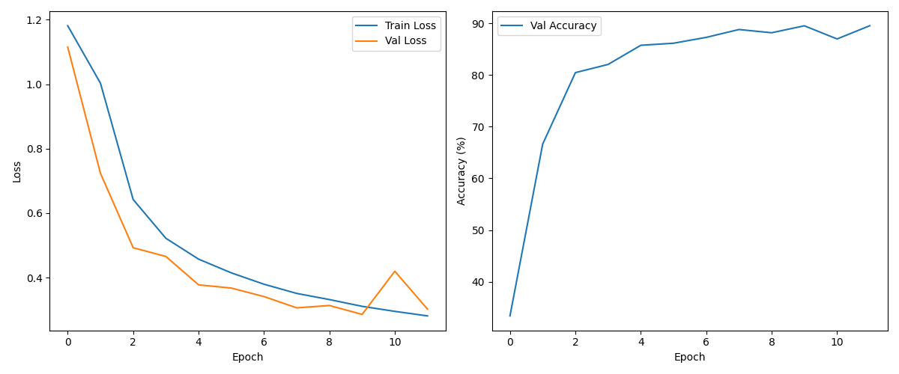
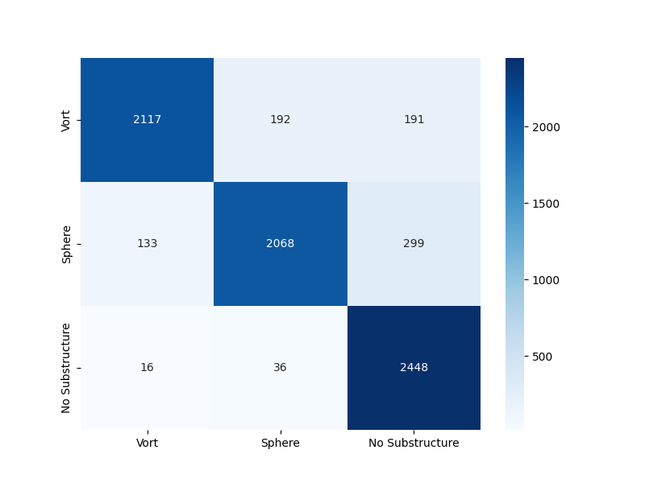
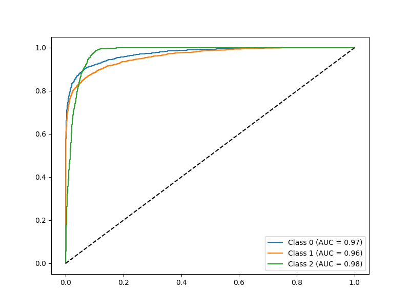

# Physics-Informed Gravitational Lens Classification

## Overview
This project implements a physics-informed deep learning model for classifying gravitational lensing images into three categories: Vortex (Vort), Sphere, and No Substructure. The model combines a custom physics layer with a pre-trained ResNet18 backbone to improve performance by incorporating domain knowledge.

## Key Features
- **Physics-Informed Layer**: Custom `LensingPhysicsLayer` that applies simplified gravitational lensing equations
- **Hybrid Loss Function**: Combines standard cross-entropy loss with physics-based regularization
- **Transfer Learning**: Uses pre-trained ResNet18 weights, adapted for single-channel input
- **Comprehensive Evaluation**: Includes ROC curves, confusion matrices, and classification reports

## Dataset
- **Dataset Directory**: `/dataset/`
  - `train/`: Training images (.npy files)
  - `val/`: Validation images (.npy files)
- **Classes**:
  - 0: Vortex (Vort)
  - 1: Sphere
  - 2: No Substructure

## Model Architecture
1. **Physics Layer**:
   - Implements θ_E²/r lensing equation
   - Contains trainable Einstein radius parameter
2. **Backbone**:
   - Modified ResNet18 (adapted for 1-channel input)
   - Final fully-connected layer outputs 3 classes

## Training
- **Loss Function**: Weighted CrossEntropyLoss + Physics Regularization
- **Optimizer**: AdamW (lr=0.0001, weight_decay=1e-4)
- **Scheduler**: ReduceLROnPlateau
- **Class Weights**: [1.0, 1.5, 1.2] (to handle imbalance)
- **Early Stopping**: Triggered if validation accuracy < 90% after 10 epochs

## Results
Outputs are saved in the `results/` folder:

- **Best Accuracy**: `terminal_accuracy.png`
  
- **Training Curves**: `training_curves.png`
  
- **Confusion Matrix**: `confusion_matrix.png`
  
- **ROC Curves**: `roc_curve.png`
  

## How to Run
1. Clone the repository.
2. Install dependencies: `pip install -r requirements.txt`.
3. Run the model:
   - **Option 1**: Execute the Python script: `python model.py`.
   - **Option 2**: Run the Jupyter Notebook: `model.ipynb`.
