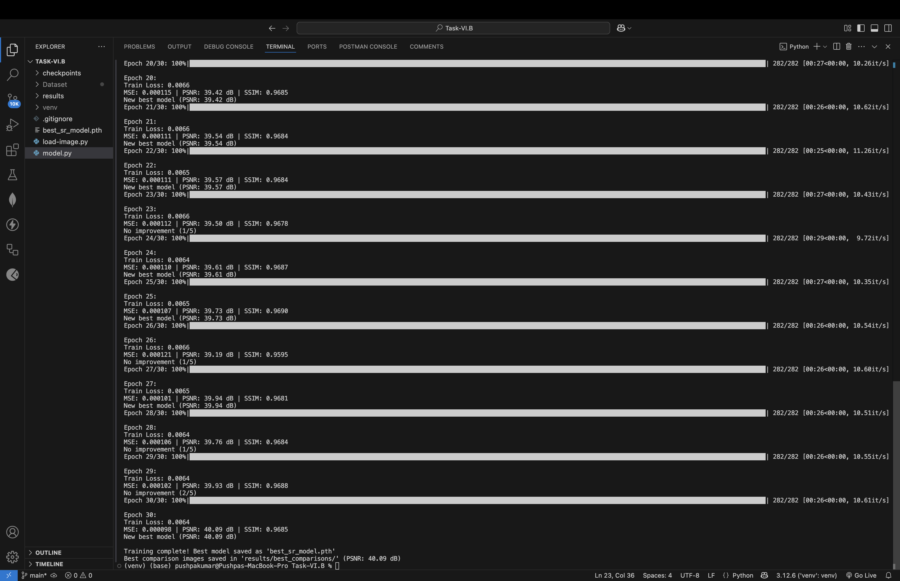
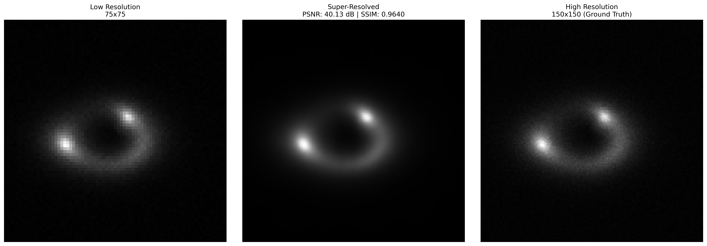
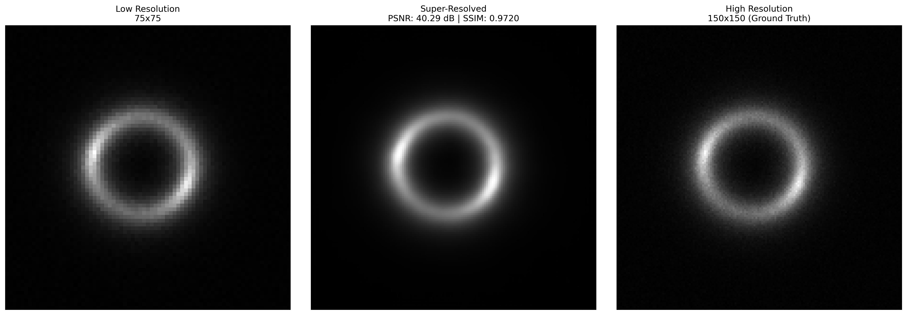
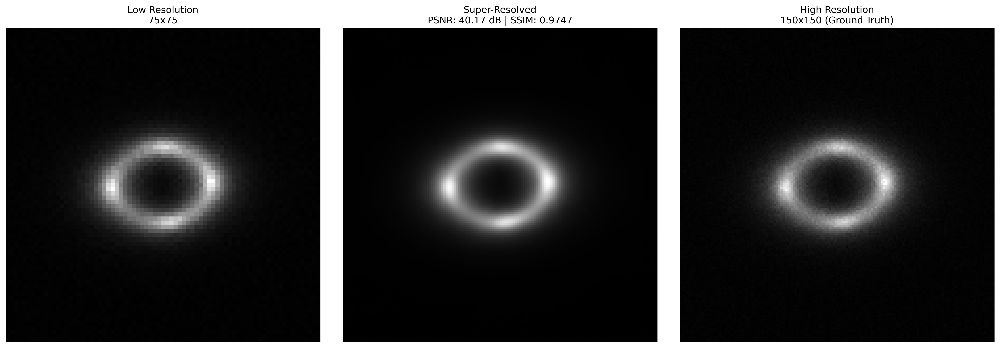

# Specific Test VI: Super-Resolution Model (Task VI.B)

## Overview
This project implements a Super-Resolution (SR) model that enhances low-resolution (LR) images to high-resolution (HR) using a convolutional neural network (CNN). The model architecture consists of an encoder-decoder structure inspired by Masked Autoencoders (MAE).

## Dataset
- **Dataset Directory**: `Dataset`
  - `Dataset/LR/`: Contains low-resolution images stored as `.npy` files.
  - `Dataset/HR/`: Contains corresponding high-resolution images stored as `.npy` files.
- The dataset is split into **90% training** and **10% validation**.

## Model Architecture
- **Encoder**:
  - Three convolutional layers with Batch Normalization and ReLU activations.
  - Max Pooling layers to extract feature representations.
- **Decoder**:
  - Transposed convolutional layers for upsampling.
  - Final layers include an upsampling operation and a convolutional layer with Sigmoid activation to reconstruct the high-resolution image.

## Training
1. **Pretraining Weights**:
   - The model can initialize weights from a pre-trained Masked Autoencoder (`mae_pretrained.pth`).
   - The first convolutional layer adapts from 3-channel inputs to 1-channel grayscale images.
2. **Optimization**:
   - The model is trained using **Mean Absolute Error (L1 Loss)**.
   - Optimizer: Adam with a learning rate of `1e-4`.
   - Training stops early if validation performance does not improve for 5 epochs.
3. **Evaluation Metrics**:
   - **Mean Squared Error (MSE)**
   - **Peak Signal-to-Noise Ratio (PSNR)**
   - **Structural Similarity Index Measure (SSIM)**

## Results
- **Best Model Weights**: `best_sr_model.pth`
- **Best Super-Resolution Comparisons**:
  - Example comparisons between LR, SR, and HR images from the best-performing model:
  - Best Test Accuracy: 
    - 
    - 
    - 
    - 

## How to Run
1. Clone the repository.
2. Install dependencies: `pip install -r requirements.txt`.
3. Run the model:
   - **Option 1**: Execute the Python script: `python model.py`.
   - **Option 2**: Run the Jupyter Notebook: `model.ipynb`. 
